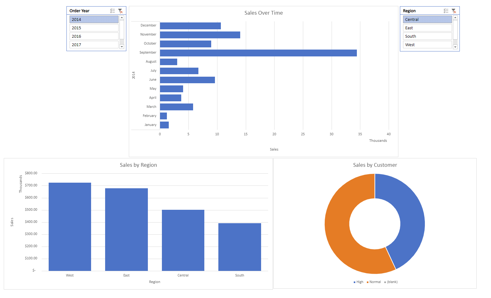

# 📊 Superstore Sales Dashboard (Excel Project)

## 💼 Overview

This Excel dashboard was created as a personal learning project to practice real-world data analysis from start to finish. I worked with fictional sales data from a Superstore company and took it through the full process: cleaning the raw data, creating new fields for grouping and segmentation, and then using PivotTables and slicers to build a one-page, interactive dashboard.

The goal was to simulate the kind of work a junior data analyst might be asked to do in a real business setting — like tracking monthly performance, comparing sales across regions, and identifying high-value customers. Everything was built in Excel Online, which meant working around certain limitations, but it helped reinforce the fundamentals of structure, logic, and storytelling with data.

In a real-world scenario, this type of dashboard could help sales or marketing teams quickly spot trends, focus on underperforming regions, or target specific customer segments for campaigns — all without needing code or external tools.

## 🎯 Project Goals

- Apply Excel to clean and analyze real-world sales data

- Build an interactive dashboard with PivotTables and slicers

- Showcase practical Excel skills in a real business context

## 📌 Key Features

- Cleaned dataset using `PROPER()`, `TRIM()`, and table formatting
- Custom fields for `Order Year`, `Order Month`, and high-value customer tagging
- PivotTables grouped by Year and Month
- Dynamic slicers for Region and Year
- PivotCharts: Sales Over Time, Sales by Region, Customer Segmentation
- One-page, presentation-ready Excel dashboard

## 🛠️ Tools Used

- Excel Online
- PivotTables & PivotCharts
- Slicers
- Excel formulas: `IF`, `AND`, `TEXT`, `YEAR`, `PROPER`, `TRIM`

## 📁 Files Included

- `Superstore_Dashboard_Project.xlsx` → Main working Excel file

---
